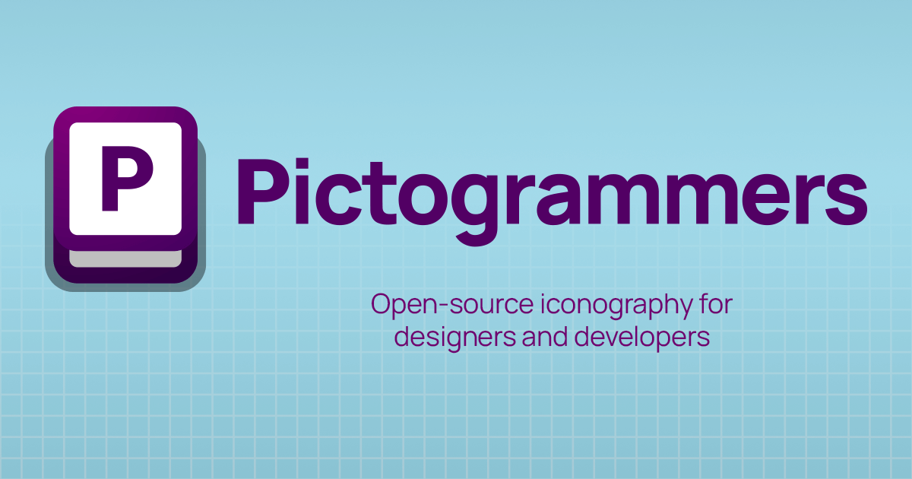

<h1 align="center">
  Pictogrammers.com
</h1>

  

    Built with <a href="https://nextjs.org/" target="_blank">Next.js</a>.
  

   

    
  

## Development

### Requirements

- Node.js v18+

### Instructions

1. Clone this repository.
2. Run `npm i`.
3. Run `npm run dev` to start the dev server.
4. Access the dev site at <http://localhost:3000>.

> The site will hot-reload as you make changes.

See <https://pictogrammers.com/docs/contribute/website/> for more details about contributing to the site.

## Env variables

To test and debug contributor fetching, specifically around GitHub, you will need to be a member of the Pictogrammers organization and have a GitHub access token.

> This is not required to work on the site, information about GitHub code contributions just will not be available when working locally if you skip this.

1. Create a GitHub personal access token.
2. Request access to the Pictogrammers organization with your token.
  - A core member will need to approve this, so it may take some time.
3. Create a `.env` file.
4. Add `API_KEY_GITHUB` to the `.env` file with your token.
5. Restart the dev server.

## Building

1. Run `npm build` to build the site.
2. The built assets will be located in the `out` folder.

## Legal

&copy; Copyright 2023 Pictogrammers. All company logos are copyrighted by their respective owners.
